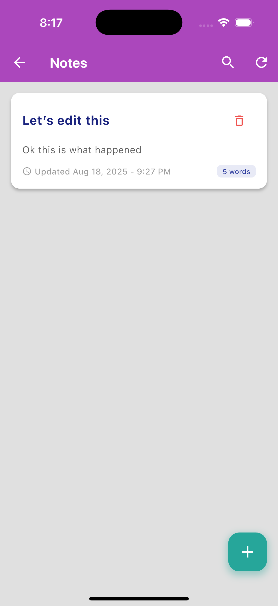
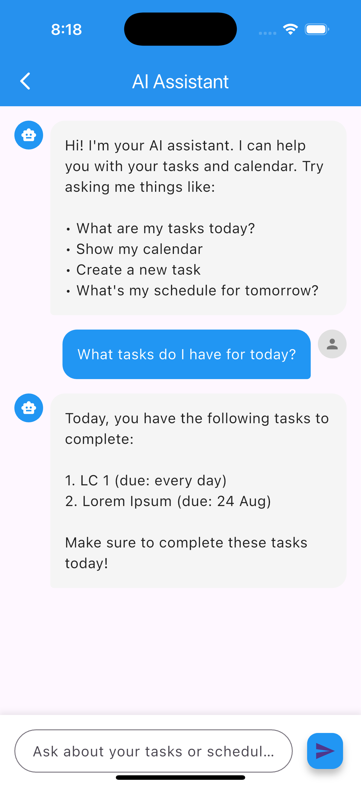
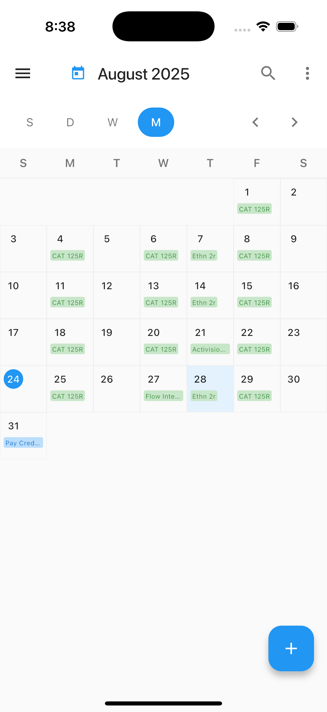
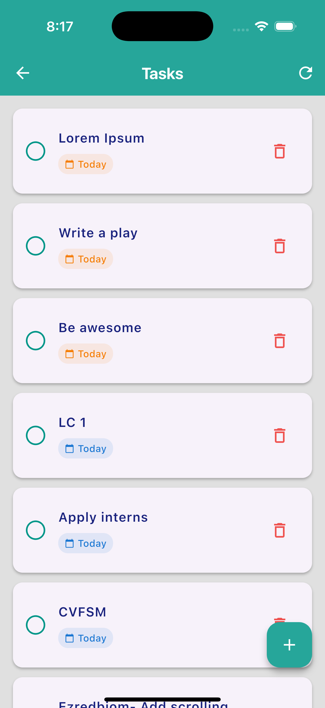

# AI Secretary  

An **AI-powered productivity assistant** designed to help students (and busy people in general) manage time, organize notes, track tasks, and interact seamlessly with their calendar.  

This project is an ongoing attempt to combine **note-taking, task management, and scheduling** with the power of AI and popular productivity tools like **Google Calendar** and **Todoist**.  

---

## ✨ Features  

- **📝 Notes**  
  - Simple notes application.  
  - All chats and notes are stored **locally** on the device.  

- **📅 Google Calendar**  
  - View upcoming events from your Google account.  
  - Event creation and **natural language processing (NLP)** are in progress.  

- **💬 Chat**  
  - AI-powered chat assistant connected to **Todoist** via the OpenAI API.  
  - Currently set up for personal use, but being expanded to support anyone with a Google + Todoist account.  
  - Planned support for **Google Gemini API** (if third-party integration is feasible).  

- **✅ Todoist Integration**  
  - Syncs tasks to and from your Google account.  
  - Provides a unified view of your tasks alongside calendar and notes.  

---

## 📸 Screenshots  

### Notes Page  
  

### Chat Page  
  

### Calendar Page  
  

### Tasks Page (Todoist)  
  

---

## 🚀 Getting Started  

Currently, the app is in **early development** and only runs on the author’s device.  
Future updates will include setup steps and installation instructions once external accounts (Google + Todoist) are fully integrated.  

---

## 🛠️ Tech Stack  

- **Flutter** (cross-platform mobile framework)  
- **Firebase** (authentication, backend services)  
- **Google Auth** (login + Google Calendar integration)  
- **HTTP** (API communication)  
- **OpenAI API** (AI assistant for chat + task handling)  
- **Todoist API** (task management integration)  

---

## 📌 Roadmap  

- [ ] Enable event creation in Google Calendar.  
- [ ] Expand NLP support for natural task/event creation (e.g., “Remind me to study at 6 PM tomorrow”).  
- [ ] Generalize the app to work for any Google + Todoist user.  
- [ ] Explore **Google Gemini** API integration for multimodal support.  
- [ ] Package and publish as an installable app.  

---

## 🤝 Contributing  

This project is currently experimental and personal, but contributions, ideas, or suggestions are welcome!  
Feel free to open issues or submit pull requests.  

---

## 📜 License  

This project is licensed under the MIT License – see the [LICENSE](LICENSE) file for details.  
